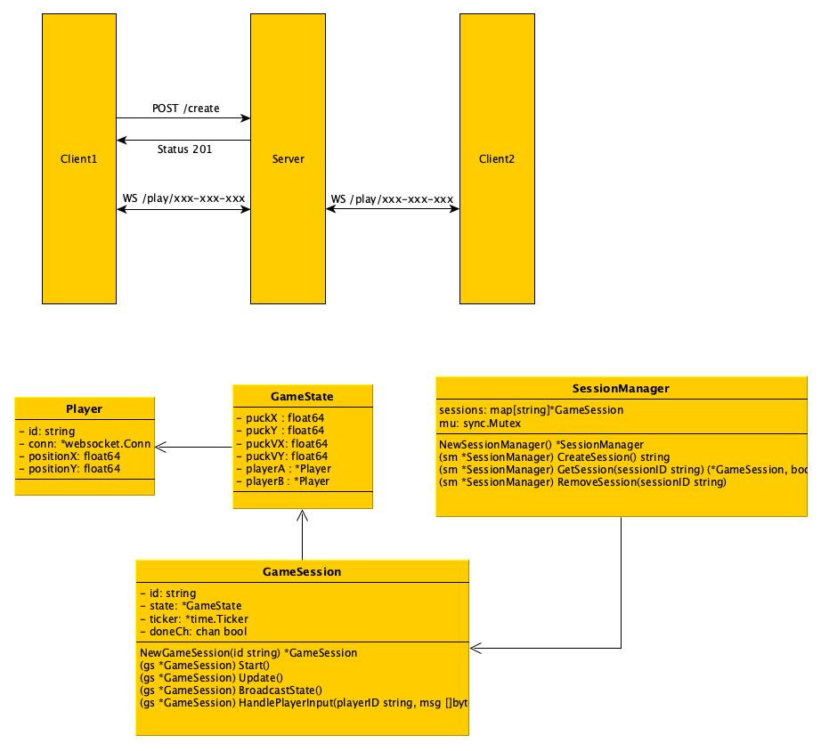

# WebHockey: The Next-Generation Multiplayer Hockey Experience

Experience the adrenaline of fast-paced, real-time hockey battles right in your browser. WebHockey brings together cutting-edge WebSocket technology and a robust Go backend to deliver seamless multiplayer gameplay with immersive physics and lightning-fast responsiveness. Whether you’re challenging friends or competing against players worldwide, every game is a high-stakes showdown.

---

## Overview

WebHockey isn’t just a game—it’s an ecosystem where every move counts. Players join via shareable session IDs to instantly jump into a competitive arena, where each goal, pass, and save is powered by our advanced backend design. Enjoy a smooth, lag-free gaming experience built for both fun and performance.

---

## In-Depth Backend Architecture

Our backend is engineered in Go with a focus on modularity, scalability, and efficiency. Below is a deep dive into the components and design patterns that make WebHockey stand out:

### Architecture Diagram



*Figure 1: High-level view of WebHockey’s backend architecture.*

### Core Components

1. **Session Management**
   - **Manager:** Oversees the entire lifecycle of game sessions including creation, retrieval, and removal, ensuring every match runs smoothly.
   - **Session:** Acts as an isolated arena for two players, maintaining game state and synchronizing gameplay.

2. **Game Physics Engine**
   - **Real-Time Collision Detection:** Dynamically calculates interactions between players and the puck.
   - **Advanced Puck Dynamics:** Implements realistic movement, bouncing, and friction for an authentic hockey feel.
   - **Goal Detection & Scoring:** Instantly recognizes scoring events, updating the game state with minimal latency.

3. **WebSocket Communication**
   - **Bidirectional Data Streams:** Maintains a constant, low-latency connection between clients and the server.
   - **Responsive Player Input Handling:** Processes input in real time to ensure every move is reflected immediately.
   - **Dynamic Game State Broadcasting:** Keeps all players synchronized through frequent, event-driven updates.

### Key Design Patterns

- **Actor Model:** Each game session runs as an independent actor with its own state and game loop, ensuring isolation and improved fault tolerance.
- **Event-Driven Architecture:** The backend reacts dynamically to game events (e.g., player movements, collisions, goals), providing a responsive and interactive gaming experience.
- **Thread-Safe Resource Management:** Leveraging mutexes and other synchronization techniques to ensure safe concurrent access to shared resources.

---

## Go-Powered Performance

WebHockey harnesses the power of Go to maximize performance and reliability. Here’s how our backend leverages Go’s standout features:

### Goroutines and Concurrency

- **Efficient Concurrency:** Each game session and player connection operates on its own lightweight goroutine, facilitating thousands of concurrent connections without compromising performance.
- **Channel Communication:** Utilizing channels for seamless communication and graceful termination signals ensures smooth operation of the game loop.
- **Precise Timing:** Our game loop is driven by `time.Ticker`, providing accurate and efficient time management.

### Memory Safety and Type System

- **Automatic Garbage Collection:** Ensures optimal memory usage without manual intervention.
- **Value Semantics & Pointer Clarity:** Our clear data ownership model minimizes runtime errors and improves reliability.
- **Structured Data Modeling:** Using struct embedding and implicit interface satisfaction to build a clean and maintainable codebase.

### Leveraging the Standard Library and External Libraries

- **Built-in HTTP and JSON Handling:** Utilizes Go’s `net/http` and `encoding/json` for a robust and dependency-free server setup.
- **Concurrency Tools:** The `sync` package guarantees thread-safe operations.
- **Industry-Standard Tools:**
  - **gorilla/websocket:** Ensures a production-ready WebSocket implementation.
  - **gorilla/mux:** Provides flexible and powerful HTTP routing.
  - **google/uuid:** Generates unique identifiers for sessions and players reliably.

---

## Getting Started

### Prerequisites

- **Go 1.15 or higher**
- **Modern web browser with WebSocket support**

### Installing Dependencies

```bash
go get -u github.com/gorilla/websocket
go get -u github.com/gorilla/mux
go get -u github.com/google/uuid
```

### Running the Server

Navigate to your backend directory and start the server:

```bash
cd /path/to/WebHockey/backend
go run .
```

For a smoother development workflow, use `air` for automatic server reloads on code changes:

```bash
cd /path/to/WebHockey/backend
air
```

The server listens on port **8080**. Visit [http://localhost:8080](http://localhost:8080) to get started.

### Launching a Game

1. **Create a Session:** Make a POST request to `/create` to obtain a unique session ID.
2. **Join the Battle:** Connect to `/play/{sessionID}` via WebSocket from two different browsers or tabs.
3. **Game On:** Experience the real-time action and compete to score the winning goal!

---

## Project Structure

```plaintext
/backend
  ├── main.go       # HTTP server setup and WebSocket handling
  ├── manager.go    # Session management and lifecycle
  ├── session.go    # Game logic, physics, and state management
  └── README.md     # Project documentation
```

Currently there is only a demo implementation of a frontend, located in the `static` directory. This frontend is a simple HTML page that connects to the backend server and allows two players to play a game of hockey. This implementation is for demonstration purposes only and will be replaced with a more robust frontend for a complete gaming experience. When the app is running open `http://localhost:8080/static` in two different tabs or browsers to start a game.

---

## Future Enhancements

Our roadmap includes exciting features to further elevate your gaming experience:

- **Full-Fledged Frontend:** A rich, interactive UI with real-time updates and engaging visuals.
- **Player Authentication:** Secure and persistent user accounts.
- **Match History & Analytics:** Detailed game statistics and history tracking.
- **Enhanced Multiplayer Modes:** Multiple game rooms and spectator support.
- **Innovative Gameplay Mechanics:** Power-ups, penalties, and advanced physics simulations.

---

Embrace the thrill of competitive hockey with WebHockey—a game that’s as much about technology as it is about heart-pounding action. Get in the game and see how every line of code contributes to an unforgettable multiplayer experience!

---

Feel free to reach out with any questions or suggestions. Enjoy the game!